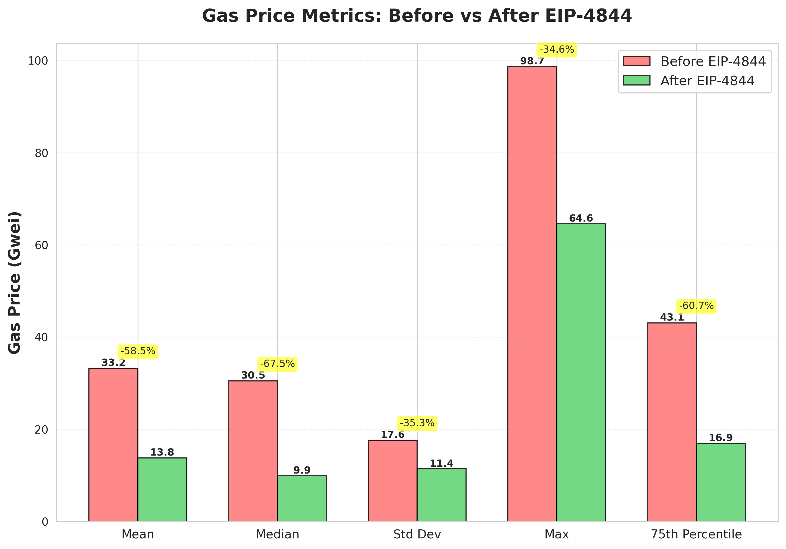
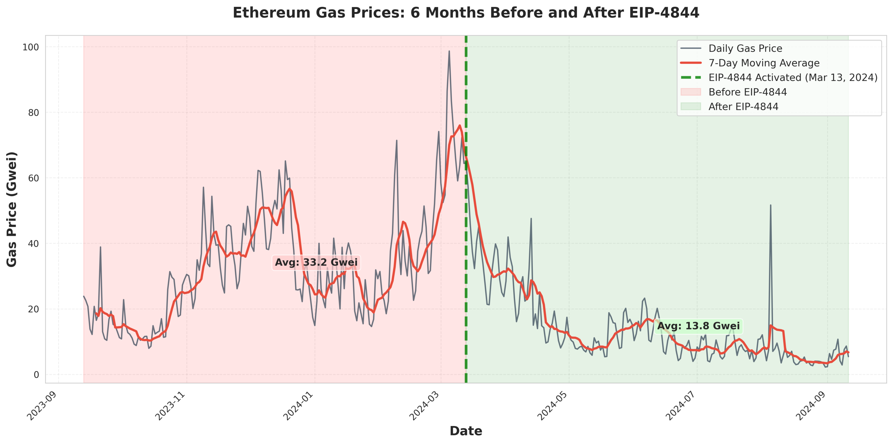

```markdown
# EIP-4844 Gas Market Impact Analysis

Empirical analysis of how EIP-4844 affected Ethereum Layer 1 gas prices.

## Key Findings

- **58.5%** average gas price reduction (33.24 → 13.78 Gwei)
- **67.5%** median price drop (30.49 → 9.91 Gwei)
- **90.9%** fewer expensive days (>50 Gwei)
- **2,225%** more cheap days (<10 Gwei)

**Insight:** EIP-4844 didn't just help Layer 2s—it made Ethereum L1 cheaper for everyone.


---

## Results

### Price Comparison



### Timeline (March 13, 2024 = EIP-4844 activation)


### Distribution Shift


### Market Transformation


---

## Methodology

**Data:** Etherscan historical gas prices (July 2015 - Nov 2024)

**Period:**
- BEFORE: Sep 13, 2023 - Mar 12, 2024 (182 days)
- AFTER: Mar 13, 2024 - Sep 11, 2024 (183 days)

**Analysis:** Descriptive statistics, distribution analysis, time series visualization

---

## Complete Results

| Metric              | Before | After  | Change   |
|---------------------|--------|--------|----------|
| Mean (Gwei)         | 33.24  | 13.78  | -58.5%   |
| Median (Gwei)       | 30.49  | 9.91   | -67.5%   |
| Volatility (StdDev) | 17.65  | 11.42  | -35.3%   |
| Max Price (Gwei)    | 98.68  | 64.57  | -34.6%   |
| Expensive Days (%)  | 18.1   | 1.6    | -90.9%   |
| Cheap Days (%)      | 2.2    | 50.8   | +2,225%  |


---

## Why Did L1 Prices Drop?

**Before EIP-4844:** L2s used calldata → competed with L1 users for block space

**After EIP-4844:** L2s use blobs → separate fee market → freed L1 capacity → lower prices

**Result:** L2s became 90%+ cheaper AND L1 became 60% cheaper. Win-win.

---

## Full Article

Read the complete analysis: [Dev.to Article Link]


---

## License

MIT License - see [LICENSE](LICENSE)

---
